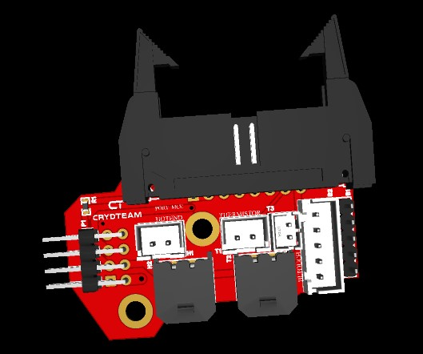

| Item | Qty |
| :------------: |----:| 
| XH-5A          | 1 |
| 2P-P3.00_MOLEX | 2 |
| PH-2AK | 1 |
| HDR-TH_8P-P2.54 | 2 |
| HDR-TH_5P-P2.54 | 1 |
| XH-2A | 2 |
| IDC-TH_16P-P2.54 | 1 |
| 470Ω | 1 |